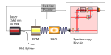
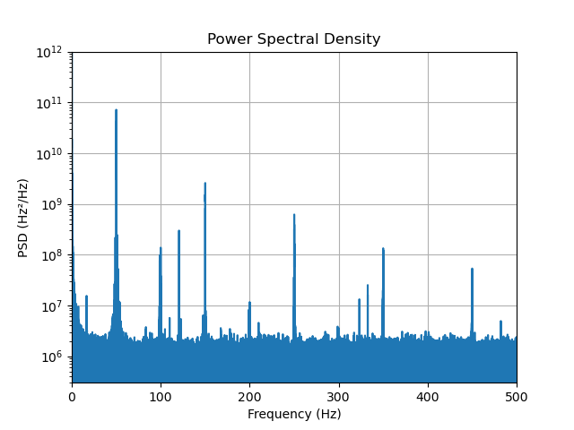
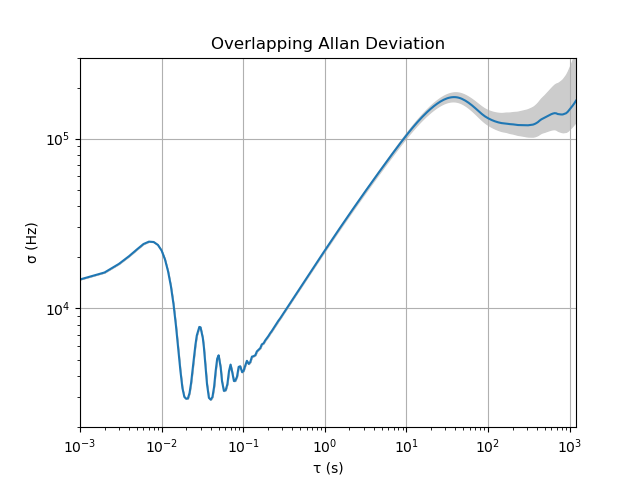

# LaserLeash S³
A Software for Spectroscopy Stabilization of your Laser (using [Stabilizer](https://github.com/sinara-hw/Stabilizer) & [Pounder](https://github.com/sinara-hw/Pounder))

Key features:
 - MQTT GUI 
 - Network Oscilloscope
 - Click & lock

Using this software we demonstrated a frequency modulation spectroscopy (FMS). A laser beat measurement with an existing modulation transfer spectroscopy (MTS) has been conducted, but a conclusive measurement on the stability of the system has yet to be made.

## Usage:
### Lock the laser
1. Start the Stabilizer with the firmware from this pull request https://github.com/quartiq/stabilizer/pull/725
1. Start MQTT broker
1. Start this Software
1. Click initialize to send initial values to stabilizer & pounder. The Stabilizer will start sweeping the output voltage.
1. Double click XY plot to zoom into that area, zoom until the transition is nicely visible, wait for old data to flush
    * Select 0.5 signal symmetry to make sure you are not prone to hysteresis, but use 1 at larger sweep ranges to improve signal quality
1. Move red line to the wanted transition with a single click
1. Click Lock. The XY plot will keep showing the last data samples, so you can check if the output value (indicated by gray line) drifts too far away. You can freeze data recording to get a more detailed look at the lock procedure. Double-click the time series to zoom in, double right click to zoom out.
* Unlock disables the PID and activates the function generator. The amplitude of the sweeping is equal to the amplitude before locking.

### Settings
* DDS: Change the modulation and demodulation properties, good values are setup dependent. The modulation and demodulation frequency should be the same, unless you intentionally want to create a bad signal.
* PID: PID parameters of the Stabilizer, this will only be applied when the system gets locked
* Connectivity: Specify MQTT server IP; where the stabilizer stream should go (usually the IP of your PC, the software listens on the specified port) and the ID of the stabilizer
* Oscilloscope: Change the behavior of data visualization; How much data to keep in the memory, how many points to show in the graph and how many consecutive data points to average. Allows freezing the memory (no new data will be written to memory while active) and saving the current memory in a file
   * The upper graph will show a time series of the stabilizer input (demodulated signal, right axis) and output (left axis)
   * The lower graph will show an XY plot of the input and output signal
* Function generator: rudimentary implementation, only control over sweeping frequency and signal symmetry implemented (change symmetry based on severeness of eg. piezo hysteresis)

## Example Setup
The screenshot above shows the spectrum of 85Rb F=3 -> F'=2,3,4 transitions including crossover peaks, recorded with the following setup.

* Fiber Laser NKT Koheras Basik Mikro at 1560 nm (~ 40 mW output, wavelength modulation with piezo)
* 99:1 fiber splitter
* EOM iXBlue MPZ-LN-10 
* SHG NTT Electronics WH-0780-000-F-B-C-M
* Frequency Modulation Spectroscopy cell Vescent D2-210-Rb-FC (~1 mW laser input power)

### Stability Measurement

To confirm the operation of this preliminary setup, a laser beat measurement has been conducted. Our setup was compared to laser light taken from an MTS stabilized atom interferometer setup, locked to 85Rb F=3 -> F'=4. The stability of this laser was not measured, so the significance of this measurement is limited. To improve this, a three-cornered hat measurement or reference with known stability is needed. Such a measurement will be performed once we have improved the initial setup.

Our laser was locked to 85Rb F=3 -> F'=3 crossover 4 with (P, I, D, sample period) parameters (0.001, 0.009, 0, 10-5). The beat signal was recorded with a Moku:Pro using a VHDL program to measure the period length ([source](./measurement/PeriodLength.vhd)).

 

The above graph shows the Power Spectral Density and the overlapping Allan deviation of the recorded beat frequency.
 The dominant noise source visible in the PSD is at 50 Hz and its harmonics. In our preliminary setup, no efforts were made to avoid ground loops. 
 In the Allan deviation strong deviations can be seen at long integration times. These are most likely due to temperature influences on our system. The demodulated error signal was showing an offset, which changed during AC cycles or even if hands were held in close proximity of the fibers.

To improve the demonstrated setup (independent of this software)
  * environmental influences have to be reduced
  * ground loops have to be evaluated
  * PID parameters have to be optimized

## Possible future features / Limitations
- Reading back MQTT parameters; at the moment it is not checked if a setting was applied successfully
- Channel selection
- Function generator with square signal
- Trigger on square signal for step response analysis
- Reset memory when values are changed; at the moment the XY plot shows a (confusing) mix of obsolete signals when settings are changed
- Detect settings at program start; at the moment it is necessary to press initialize to synchronize Software & Stabilizer & MQTT server
- Better graphs (better autoscaling, ticks, ...)
- Error signal analysis (instead maybe use https://github.com/quartiq/stabilizer-stream)
- Auto relock / out-of-lock warning

 

* The firmware that is necessary is currently not merged into the main branch of the dual-iir firmware, as a result the Stabilizer has to be reflashed after a restart (https://github.com/quartiq/stabilizer/pull/725)
* The dual-iir firmware has (at least in the PR) no parameter for an offset of the error signal. This means that the PID will always stabilize to 0 error signal, and it is not possible to compensate DC offsets of the atomic transition signal.
* The dual-iir firmware has no output limit. The ylimit of the PID does only apply to the PID, the Function generator gets added afterwards. Eg. piezos do not like negative voltages. To protect your system this has to be considered. At the moment the software limits the FG output to the ylimit values, but since it is not checked if software settings get applied, it could be possible to have PID and FG active at the same time, exceeding the ylimit range. A parameter in the stabilizer firmware that limits the final output might be usefull.
* There is a short (~1.5 ms) packet loss in the data stream after changing a parameter. This means you do not see the reaction of your system right after enabling the lock. The source of the packet loss is unknown and could also be rooted in the stabilizer firmware.
* During development of the software, an unstable DC offset was observed. It is suspected that this is due to the test setup being unprotected from the environment (and having an air conditioner blowing on it). More tests and a better setup are needed.

## Additional info:
- An SNR improvement is possible with more modulation depth (external amplifier needed, a short test at ~20 dBm with Minicircuits ZX60-100VH looked promising)
- At certain Oscilloscope & FG frequency settings the XY plot signal quality appears bad. It looks like X values get grouped. Exact source is unknown, I suspect an aliasing effect. 
- If there is a problem, check the log, eg. for connection errors or click Initialize (this will take the laser out of lock).

# Acknowledgement
This research was funded by the Federal Ministry for Economic Affairs and Climate Action (BMWK) due to an enactment of the German Bundestag under Grant 50NA2106 (QGyro+).