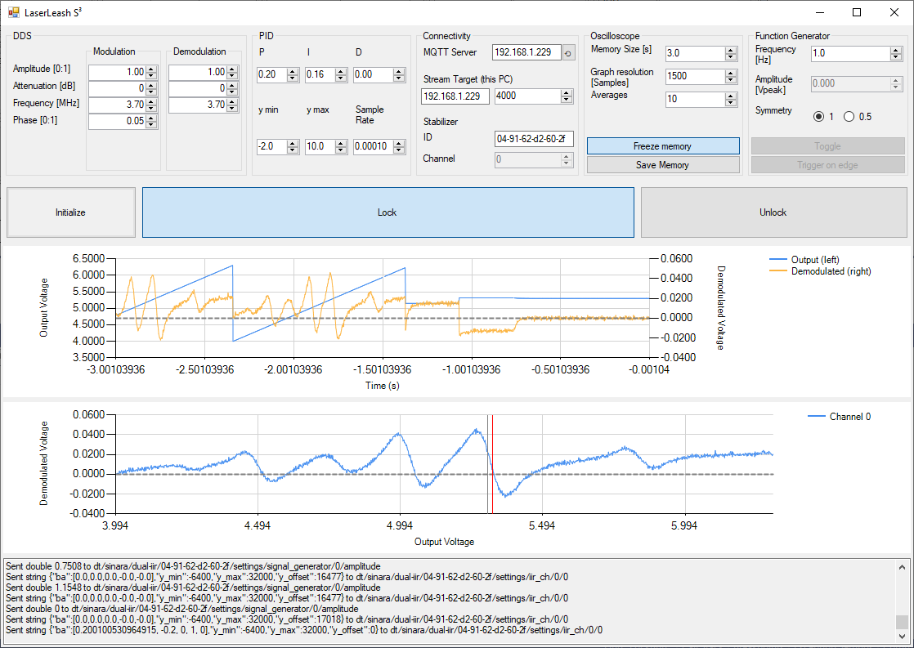
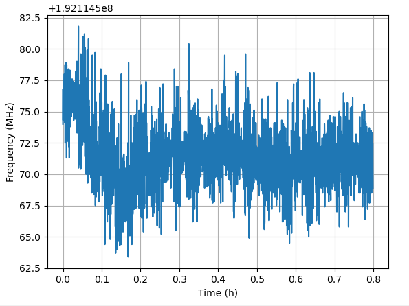

# LaserLeash S³
A Software for Spectroscopy Stabilization of your Laser (using Stabilizer & Pounder)
 - MQTT GUI 
 - Network Oscilloscope
 - Click & lock

We demonstrated a frequency modulation spectroscopy and reached a stability of TODO.

## Usage:
### Lock the laser
1. Start the Stabilizer with the firmware from this pull request https://github.com/quartiq/stabilizer/pull/725
1. Start MQTT broker
1. Start this Software
1. Click initialize to send initial values to stabilizer & pounder
1. Double click XY plot to zoom into that area, zoom until the transition is nicely visible, wait for old data to flush
    * Select 0.5 signal symmetry to make sure you are not prone to hysteresis, but use 1 at larger sweep ranges to improve signal quality
1. Move red line to the wanted transition with a single click
1. Click Lock. The XY plot will keep showing the last data samples, so you can check if the output value drifts too far away. You can freeze data recording to get a more detailed look at the lock procedure. Double-click the time series to zoom in, double right click to zoom out.
* Unlock disables the PID and activates the function generator. The amplitude of the sweeping is equal to the amplitude before locking.

### Settings
* DDS: Change modulation and demodulation properties, good values are setup dependent. The modulation and demodulation frequency should be the same, unless you intentionally want to create a bad signal.
* PID: PID parameters of the Stabilizer, this will only be applied when the system gets locked
* Connectivity: Specify MQTT server IP; where the stabilizer stream should go (usually the IP of your PC, the software also listens on the specified port) and the ID of the stabilizer
* Oscilloscope: Change behavior of data visualization; How much data to keep in the memory, how many points to show in the graph and how many consecutive data points to average. Allows freezing the memory (no new data will be written to memory while active) and saving the current memory in a file
   * The upper graph will show a time series of the stabilizer input (demodulated signal, right axis) and output (left axis)
   * The lower graph will show an XY plot of the input and output signal
* Function generator: rudimentary implementation, only control over sweeping frequency and signal symmetry implemented (change symmetry based on severeness of eg, piezo hysteresis)

## Example Setup
* Fiber Laser 1560 nm NKT Koheras Basik Mikro (~ 40 mW output, wavelength modulation with piezo)
* 99:1 fiber splitter (for beat measurement)
* EOM iXBlue MPZ-LN-10 
* SHG NTT Electronics WH-0780-000-F-B-C-M
* Frequency Modulation Spectroscopy cell Vescent D2-210-Rb-FC (~ 1 mW laser input power)

TODO add schematic of setup

The image above shows the spectrum of Rb85 F=3, F'=2,3,4 including crossover peaks, recorded with this setup.

## Tests
* TODO

Wavelength measurement with a Bristol 671A. PID values 0.4, 0.16, 0 (not optimized). The datasheet of the wavelength meter specifies a repeatability of ~15 MHz.

## Possible future features
- Reading back MQTT parameters, at the moment it is not checked if a setting was applied successfully
- Channel selection
- Function generator with square signal
- Trigger on square signal for step response analysis
- Reset memory when values are changed, at the moment the XY plot shows a (confusing) mix of obsolete signals when settings are changed
- Detect settings at program start, at the moment it is necessary to press initialize to synchronize Software & Stabilizer
- Better graphs (better autoscaling, ticks, ...)
- Error signal analysis (instead maybe use https://github.com/quartiq/stabilizer-stream)
- Auto relock / out-of-lock warning

## Limitations
* The firmware that is necessary is currently not merged into the main branch of the dual-iir firmware, as a result the Stabilizer needs to be flashed after a restart (https://github.com/quartiq/stabilizer/pull/725)
* The dual-iir firmware has (at least in the PR) no parameter for an offset of the error signal. This means that the PID will always stabilize to 0 error signal, and it is not possible to compensate DC offsets of the atomic transition signal.
* The dual-iir firmware has no output limit. The ylimit of the PID does only apply to the PID, the Function generator gets added afterwards. Eg. piezos do not like negative voltages. To protect your system this has to be considered. At the moment the software limits the FG output to the ylimit values, but since it is not checked if software settings get applied, it could be possible to have PID and FG active at the same time, exceeding the ylimit range. A parameter in the stabilizer firmware that limits the final output might be usefull.
* There is a short (~1.5 ms) packet loss in the data stream after changing a parameter. This means you do not see the reaction of your system right after enabling the lock. The source of the packet loss is unknown.
* During development of the software, an unstable DC offset was observed. It is suspected that this is due to the test setup being unprotected from the environment (and having an air conditioner blowing on it). More tests and a better setup are needed.

## Additional info:
- SNR improvement possible with more modulation depth (external amplifier needed, a short test at ~20 dBm with Minicircuits ZX60-100VH looked promising)
- At certain Oscilloscope & FG frequency settings the XY plot signal quality appears bad. It looks like X values get grouped. Exact source is unknown, I suspect an aliasing effect. 
- After changing settings, the memory does not get flushed. Reduce the memory size to not have old and new data overlapping in the XY plot.
- Eg. piezos have hysteresis. This can make the signal appear bad. To avoid this, change the signal symmetry to 1.
- If there is a problem, check the log, eg. for connection errors or click Initialize (this will take the laser out of lock). Rarely, settings do not get applied. Reason unknown (packet loss?).

# Acknowledgement
This research was funded by the Federal Ministry for Economic Affairs and Climate Action (BMWK) due to an enactment of the German Bundestag under Grant 50NA2106 (QGyro+).